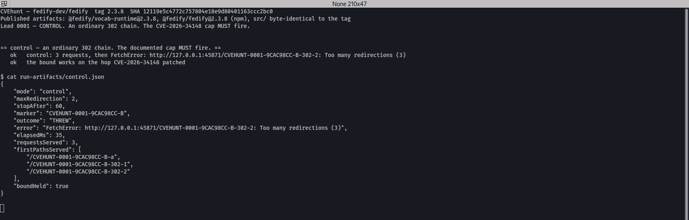
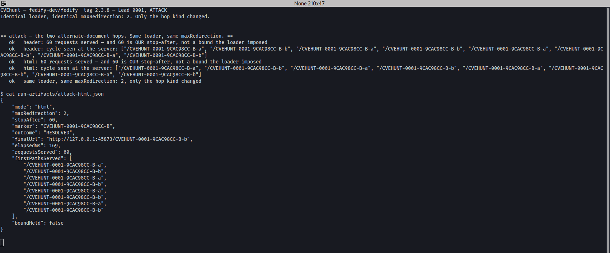
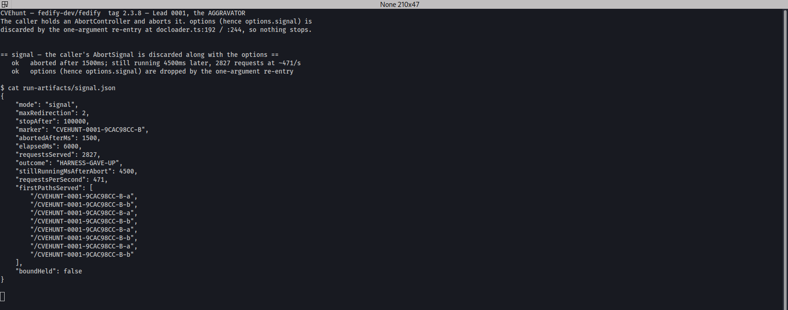

# The alternate-document hop resets the `CVE-2026-34148` redirect cap and visited-URL set, and drops the caller's `AbortSignal`

**Fedify** · `GHSA-97w4-f4rq-mgqm` · reported 2026-09-28 · fixed in `2.3.9` · CVE requested by the maintainer, pending

| | |
|---|---|
| **Target** | Fedify (`fedify-dev/fedify`) — `@fedify/vocab-runtime`, `@fedify/fedify` |
| **Affected** | Measured unbounded on **every published line tip**: `@fedify/vocab-runtime` 2.3.8 / 2.2.13 / 2.1.24 / 2.0.28 and `@fedify/fedify` 1.10.11 / 1.9.12 |
| **Fixed in** | `2.3.9` (2026-09-29) — commit [`2659f5ae`](https://github.com/fedify-dev/fedify/commit/2659f5ae56), *"Bound alternate document resolution"*. Also in 2.2.14 / 2.1.25 / 2.0.29 |
| **Class** | Resource exhaustion / unbounded outbound amplification, plus discarded cancellation signal |
| **Severity** | Same vector as the parent advisory: `CVSS:3.1/AV:N/AC:L/PR:N/UI:N/S:U/C:N/I:N/A:H` |
| **Identifier** | `GHSA-97w4-f4rq-mgqm` — advisory **not yet published**; the maintainer **requested a CVE unprompted**, id pending. Public credit already live in [`CHANGES.md`](https://github.com/fedify-dev/fedify/blob/main/CHANGES.md) |
| **Reported by** | Adel Zaitri |

> **Status note.** The advisory is still in draft, so its link does not resolve publicly yet. The
> fix, the commit, and the credit are all public now — see [Outcome](#outcome).

---

## Summary

`GHSA-gm9m-gwc4-hwgp` / `CVE-2026-34148` fixed unbounded redirect following in Fedify's document
loader by adding a redirect cap and a visited-URL set. The project's own `CHANGES.md` describes
the fix:

> "Limited the number of HTTP redirects followed by the remote document loaders [...] Stopped the
> remote document loaders [...] from revisiting the same URL within a redirect chain, preventing
> self-referential redirect loops. [CVE-2026-34148]"

Both bounds live in `load()` as **default parameters**. The `3xx` path threads them through
correctly. But `getRemoteDocument()` takes a *second* kind of hop — the JSON-LD **alternate
document** link, from either the `Link` response header or an HTML `<link rel="alternate">` — and
that hop re-enters the loader through a **bare one-argument call**.

Because `redirected` and `visited` are default parameters, a one-argument call resets the counter
to `0` and the visited set to empty. And because `options` is omitted too, the caller's
`options.signal` is discarded with it.

So a remote host answering with a two-node alternate-document cycle drives an **unbounded** loop
through the same entry point the parent advisory used — an unauthenticated `POST` to an inbox —
and the caller cannot stop it.

---

## The architecture that made it possible

**A security bound expressed as a default parameter is a bound that any caller can silently
reset.** That is the whole finding, and it is worth stating at that altitude because the specific
hop is replaceable — any future re-entry written as `fetch(url)` reintroduces it.

```ts
async function load(
  url: string,
  options?: DocumentLoaderOptions,
  redirected = 0,                    // the CVE-2026-34148 cap
  visited = new Set<string>(),       // the CVE-2026-34148 loop detector
): Promise<RemoteDocument>
```

The invariant "a single logical document resolution follows at most N hops and visits no URL
twice" is real, and it is enforced — but it is carried in *arguments the caller must remember to
pass*. `load` is then handed to `getRemoteDocument()` as a plain `fetch` callback, at which point
the type system sees a one-argument function and the accumulated state is invisible at the call
site. Nothing about `fetch(altUri.href)` looks wrong when you read it.

Three structural lessons generalise:

**The parent fix was scoped to a hop, not to the resolution.** `CVE-2026-34148` was fixed where
redirects were followed. But "how many network hops may one document resolution take" is a
property of the resolution, and there was more than one kind of hop. A patch that lands on one
branch of a tree leaves the others looking patched.

**Cycle detection was implemented twice, locally, and both copies check the wrong thing.** Both
alternate-document guards reject only a *self*-reference — `altUri.href !== docUrl.href` at
`:186`, and the same comparison at `:238`. A two-node cycle defeats both. The visited-URL set
that *would* have caught it is the one the re-entry reset. There were two mechanisms available
and the weaker local one was the only one in the path.

**Discarding an `AbortSignal` is the same bug wearing different clothes.** `options` travels in
the same argument list as the bounds, so one omission drops cancellation along with the cap. A
loop you cannot bound *and* cannot cancel is a different severity class from one you can kill.

The rule I would take to any similar loader: **accumulated safety state belongs in a closure or
an explicit context object, never in default parameters** — and a function handed onward as a
callback should not be the same function that carries the state.

---

## Impact

**Same entry point, same impact, same CVSS vector as `CVE-2026-34148`** —
`AV:N/AC:L/PR:N/UI:N/S:U/C:N/I:N/A:H`, as stated in that advisory.

Quoting the parent advisory's own description of the flow, which I reproduced:

> "Fedify verifies ActivityPub HTTP signatures by fetching the remote `keyId` during request
> processing. The relevant flow is `handleInboxInternal()` → `verifyRequest()` →
> `fetchKeyInternal()` → document loader."
>
> "if an attacker-controlled `keyId` or actor URL responds with `302 Location: <same URL>`, a
> single ActivityPub request can trigger tens or hundreds of outbound requests"

Substitute *"responds with an alternate-document link pointing at a second URL that points
back"* and that sentence describes this report — except there is no "tens or hundreds," because
there is no bound at all. In one run a single inbound request produced **2,827 outbound requests
in six seconds, roughly 470 per second**, and was still going when the harness gave up.

Each hop also runs `validatePublicUrl()`, so an equal number of DNS lookups is amplified
alongside the HTTP requests.

**The aggravating half: the caller cannot cancel it.** `load()` checks
`options?.signal?.throwIfAborted()` on entry (`docloader.ts:308`), but the alternate-document
re-entry passes no `options`, so from that hop onward there is no signal to check. I aborted an
`AbortController` at 1,500 ms; the loader was still issuing requests **4,500 ms later**.

That half is unambiguous on any reading. Silently discarding a caller-supplied `AbortSignal` is a
bug whether or not per-hop alternate-document following is intended behaviour — which is useful,
because it means the report does not depend on winning an argument about intent.

**What an integrating server has to do for this to be live: nothing beyond the ordinary.**
`getDocumentLoader()` is the default document loader, `keyId` fetching during HTTP-Signature
verification happens on every signed inbound request, and `allowPrivateAddress` stays at its
default `false` — the destination is the attacker's own public host, so the SSRF guard is not in
the path at all.

---

## Affected versions

Every published line tip was installed into its own tree and run through the same probe. **This
is measured, not inferred:**

```
@fedify/vocab-runtime  2.3.8    UNBOUNDED  (60 requests, our stop)
@fedify/vocab-runtime  2.2.13   UNBOUNDED  (60 requests, our stop)
@fedify/vocab-runtime  2.1.24   UNBOUNDED  (60 requests, our stop)
@fedify/vocab-runtime  2.0.28   UNBOUNDED  (60 requests, our stop)
@fedify/fedify         1.10.11  UNBOUNDED  (60 requests, our stop)
@fedify/fedify         1.9.12   UNBOUNDED  (60 requests, our stop)
```

**Each of those sits above one of the parent advisory's own declared fixed versions.**
`GHSA-gm9m-gwc4-hwgp` declares fixed at `@fedify/fedify` 1.9.6 / 1.10.5 / 2.0.8 / 2.1.1 and
`@fedify/vocab-runtime` 2.0.8 / 2.1.1. The `3xx` cap is present and working in all of them — the
control run proves it — and the alternate-document hop was never threaded in any line.

I noted their support policy is the latest two minor versions, reported the full measured range
anyway because the parent advisory had patched six lines, and said the range was theirs to set.

---

## Reproduction

Automated in `evidence/repro.sh`, run end to end from a clean state before the report was
written:

```bash
./repro.sh all      # up -> control -> attack -> signal -> repeat 3 -> down
./repro.sh full     # the same, plus the six-version range table above
```

Node v24.18.0. Every server binds to `127.0.0.1`. The loader is constructed as
`getDocumentLoader({ allowPrivateAddress: true, maxRedirection: 2 })` in **every** row below,
control and attack alike — so the only thing that changes between them is the kind of hop the
server offers.

### The response that triggers it, verbatim

HTML `<link rel="alternate">` path:

```http
HTTP/1.1 200 OK
Content-Type: text/html

<html><head><link rel="alternate" type="application/activity+json"
  href="http://127.0.0.1:45899/MARKER-b"></head></html>
```

`Link` response-header path — note the content type is `text/plain`, so the HTML branch is not
even required:

```http
HTTP/1.1 200 OK
Content-Type: text/plain
Link: <http://127.0.0.1:45898/MARKER-b>; rel="alternate"; type="application/activity+json"

not json-ld
```

`/…-a` points at `/…-b` and `/…-b` points back.

### The control — an ordinary 302 chain, identical loader

```json
{
  "mode": "control", "maxRedirection": 2, "outcome": "THREW",
  "error": "FetchError: http://127.0.0.1:45871/MARKER-302-2: Too many redirections (3)",
  "requestsServed": 3, "boundHeld": true
}
```

Three requests — the first plus the two redirects allowed — then the documented error. **The
bound works on the hop `CVE-2026-34148` patched.** This control is what makes the finding a
missed hop rather than a claim that the parent fix never worked.



### The attack

```json
{ "mode": "header", "maxRedirection": 2, "outcome": "RESOLVED",
  "requestsServed": 60, "boundHeld": false,
  "firstPathsServed": ["/MARKER-a","/MARKER-b","/MARKER-a","/MARKER-b","…"] }

{ "mode": "html", "maxRedirection": 2, "outcome": "RESOLVED",
  "requestsServed": 60, "boundHeld": false }
```

**60 is the test server's own stop-after value, not a bound the loader imposed.** The server
answers request 60 with a valid ActivityStreams document purely so the process can terminate and
report; the chain was still going.



### The aggravator — the caller's `AbortSignal` is discarded

Same cycle, caller aborts at 1,500 ms, harness gives up at 6,000 ms:

```json
{
  "mode": "signal", "abortedAfterMs": 1500, "elapsedMs": 6000,
  "requestsServed": 2827, "outcome": "HARNESS-GAVE-UP",
  "stillRunningMsAfterAbort": 4500, "requestsPerSecond": 471, "boundHeld": false
}
```



### Determinism

Three consecutive reproductions, each a fresh process with a fresh server on a fresh port and a
freshly constructed loader. 3/3, no intermittency here or across the six range runs.

---

## Root cause

Line numbers at `2.3.8`, and — usefully — they are also the line numbers **in the installed npm
package**, because the tarball ships `src/` alongside `dist/`.
`node_modules/@fedify/vocab-runtime/src/docloader.ts` is byte-identical to
`packages/vocab-runtime/src/docloader.ts` at the tag (sha256 `aca59c96…`), and the cited call is
separately confirmed present in the compiled `dist/mod.js`. That matters: the finding is against
the artifact a user installs, not against a source tree that might differ from it.

**The bounds are default parameters** — `:302-307`:

```ts
async function load(
  url: string,
  options?: DocumentLoaderOptions,
  redirected = 0,
  visited = new Set<string>(),
): Promise<RemoteDocument> {
```

**The `3xx` path threads them through** — `:385`:

```ts
return await load(redirectUrl, options, redirected + 1, visited);
```

**That same `load` is handed to `getRemoteDocument()` as its `fetch` parameter** — `:388`:

```ts
const result = await getRemoteDocument(currentUrl, response, load);
```

**And `getRemoteDocument()` calls it with one argument on both alternate-document hops:**

```ts
192:  return await fetch(altUri.href);                            // Link header path
244:  return await fetch(new URL(attribs.href, docUrl).href);     // HTML path
```

`:192` is guarded only by `:186`, `:244` only by `:238`. Both guards reject a self-reference and
neither detects a cycle.

**The same shape is in the authenticated loader**, which passes its own `load` the same way —
`packages/fedify/src/utils/docloader.ts:87`.

---

## The fix, as shipped — and the review I did of it

The maintainer sent a proposed patch before merging. I applied both halves by hand to the
compiled 2.3.8 artifacts in an isolated copy of the lab and re-ran the probes against them. Full
review in [`evidence/REVIEW-proposed-fix.md`](evidence/REVIEW-proposed-fix.md), raw output in
[`evidence/evidence.txt`](evidence/evidence.txt).

**Verdict: the fix worked. The reported attack was dead.**

| Probe (`maxRedirection: 2`, two-node cycle) | 2.3.8 | patched |
|---|---|---|
| `Link: rel=alternate` cycle | 60 requests (our stop) | **2 requests**, `Redirect loop detected` |
| HTML `<link rel=alternate>` cycle | 60 requests (our stop) | **2 requests**, `Redirect loop detected` |
| caller aborts mid-chain | still running 4.5 s after abort | **throws ~7 ms after abort**, `error === reason` |

Three things in the diff were right and worth saying so:

- `getRemoteDocument(currentUrl, …)` instead of `getRemoteDocument(url, …)` fixes a *separate*
  latent bug — relative alternate links after a redirect previously resolved against the
  pre-redirect URL whenever `response.url` was empty.
- `return (url, options) => load(url, options)` stops an external caller seeding `redirected` or
  `visited`. That matters more than it looks: a shared `visited` set passed in from outside would
  be a cross-request oracle.
- The new cycle tests cover interleavings I would not have thought to write —
  `redirect-intermediate`, and tracking fallback redirects after alternates.

**And one regression the patch introduced, which is the part of this report I am most pleased
with.** `follow()` hardcoded `DEFAULT_MAX_REDIRECTION` and ran on **every** hop — including plain
`3xx` redirects, because the new `validateRedirect` calls it. `maxRedirection` was destructured
three lines above and forwarded to `doubleKnock`, so the two limits disagreed and the hardcoded
one won whenever a caller asked for more than 20:

```
2.3.8    THREW  Too many redirections (51)   requestsServed: 51   <- honours the caller
patched  THREW  Too many redirections (21)   requestsServed: 21   <- silently clamped to 20
```

No alternate links involved. A behaviour change to the redirect path that the advisory did not
mention and no test covered. **Reviewing the fix found a second defect that the fix itself
introduced** — which is the argument for treating fix review as part of the report rather than as
a courtesy.

The shipped commit, [`2659f5ae`](https://github.com/fedify-dev/fedify/commit/2659f5ae56), is
described in `CHANGES.md` as: *"Alternate links now share the 20-hop limit and loop detection
with HTTP redirects, and preserve the caller's cancellation signal."* All three halves of the
report — the cap, the loop detection, and the signal — are addressed.

---

## Outcome

| Date | Event |
|---|---|
| 2026-09-27 | Confirmed: control, both attack paths, the abort row, six-version range table, 3/3 |
| 2026-09-28 | Reported via GitHub Private Vulnerability Reporting as `GHSA-97w4-f4rq-mgqm` |
| 2026-09-29 | Maintainer proposes a patch; I review it against the compiled artifacts and report one regression |
| 2026-09-29 | Fix merged as [`2659f5ae`](https://github.com/fedify-dev/fedify/commit/2659f5ae56) and released in `2.3.9`, backported to 2.2.14 / 2.1.25 / 2.0.29 |
| 2026-09-30 | **Maintainer requests a CVE unprompted.** Id pending; advisory still in draft |

**This is the best-run disclosure of the set, and the difference was the project, not the
report.** Fedify publishes advisories as a matter of course — ten published advisories with CVEs
over the preceding ten months — and the maintainer asked for the identifier without being
prompted, which is the entire escalation ladder skipped in one reply.

Public credit is already live in `CHANGES.md` on `main`, under Version 2.3.9:

> "Fixed `getAuthenticatedDocumentLoader()` following unbounded chains of alternate document
> links, which could exhaust resources during remote key and document resolution. Alternate
> links now share the 20-hop limit and loop detection with HTTP redirects, and preserve the
> caller's cancellation signal. \[GHSA-97w4-f4rq-mgqm by Adel Zaitri\]"

So the artifact exists before the advisory does. That is worth noting as a general matter: a
changelog credit on `main` is public, permanent, and arrives faster than any identifier.

**One residual I could not confirm.** The `@fedify/fedify` 1.9.x and 1.10.x maintenance lines
were both measured unbounded, and neither `1.9.13` nor `1.10.12` carries the `GHSA-97w4-f4rq-mgqm`
changelog entry. So either the fix was not backported to the 1.x lines, or it was backported
without a changelog note — I have not verified which, and the published advisory will carry the
authoritative ranges. Flagging it rather than guessing.

---

## How I found it

By reading the *previous* advisory's fix and asking what it did not cover.

`CVE-2026-34148` is a clean, well-described fix to unbounded redirect following. The interesting
question about any such fix is not whether it works — it does, and the control row proves it —
but whether the invariant it enforces is enforced *everywhere the invariant applies*. "How many
network hops may one document resolution take" is a property of the resolution; redirects are
only one kind of hop.

Reading `load()`'s signature answered it in about a minute. Bounds carried as default parameters
have exactly one failure mode, and it is findable by grepping for calls that pass fewer
arguments than the signature declares.

Two things worth recording:

- **The abort-signal half was not what I was looking for.** I found it while confirming the
  bounds reset, noticed `options` was being dropped by the same omission, and built the abort
  probe specifically to characterise it. It turned out to be the half that needs no argument
  about intent — and so, in report terms, the most useful one. **When one half of a finding is
  arguable and the other is not, lead with the one that is not.**
- **I measured the range instead of asserting it.** Installing all six published line tips into
  separate trees and running the same probe took an evening and produced a table nobody can
  dispute. The temptation was to test the newest, say "presumably older versions too," and let
  the maintainer work it out. The table is why the affected range in the report needed no
  negotiation.

**What the tooling did and did not do.** The harness stood up the cycling servers, drove the
control/attack/abort rows, counted requests server-side rather than trusting the client, ran the
six-version matrix, and later re-ran everything against the hand-patched artifacts for the fix
review. It did not find the bug. Reading a function signature after reading someone else's
advisory did.

---

## Credit and ethics

Thanks to [@dahlia](https://github.com/dahlia) and the Fedify maintainers: a patch proposed
within a day, a fix merged and backported across four lines within two, a CVE requested without
being asked, and a changelog credit written before the advisory was even published. That is what
a well-run security process looks like, and it is worth naming because it is not the norm.

All testing was performed locally against synthetic servers bound to `127.0.0.1`, using published
npm artifacts. No third-party host was contacted and no federated instance was involved at any
point.

---

## Evidence bundle

| File | What it is |
|---|---|
| [`evidence/repro.sh`](evidence/repro.sh) | End to end: control, both attack paths, abort row, 3× repeat, six-version matrix |
| [`evidence/control.http.txt`](evidence/control.http.txt) | The 302 control — the `CVE-2026-34148` cap holding |
| [`evidence/attack.http.txt`](evidence/attack.http.txt) | Both cycle paths, with the verbatim triggering responses |
| [`evidence/screenshot-1-control.png`](evidence/screenshot-1-control.png) | The bound working on the patched hop |
| [`evidence/screenshot-2-attack.png`](evidence/screenshot-2-attack.png) | The unbounded alternate-document cycle |
| [`evidence/screenshot-3-abortsignal.png`](evidence/screenshot-3-abortsignal.png) | 2,827 requests, still running 4.5 s after abort |
| [`evidence/range.txt`](evidence/range.txt) | The six-version affected-range matrix |
| [`evidence/repeat.log`](evidence/repeat.log) | Three reproductions, fresh process and port each time |
| [`evidence/versions.txt`](evidence/versions.txt) | Pinned package versions, Node version, the `src`/`dist` hash check |
| [`evidence/REVIEW-proposed-fix.md`](evidence/REVIEW-proposed-fix.md) | My review of the maintainer's patch, including the regression |
| [`evidence/evidence.txt`](evidence/evidence.txt) | Raw output from the fix-review probes |

## References

- [`2659f5ae`](https://github.com/fedify-dev/fedify/commit/2659f5ae56) — *"Bound alternate document resolution"*, the fix
- [`CHANGES.md`](https://github.com/fedify-dev/fedify/blob/main/CHANGES.md) — Version 2.3.9, carrying the public credit
- [`GHSA-gm9m-gwc4-hwgp` / CVE-2026-34148](https://github.com/advisories/GHSA-gm9m-gwc4-hwgp) — the parent advisory this bypasses
- `GHSA-97w4-f4rq-mgqm` — this finding's advisory, in draft at time of writing
